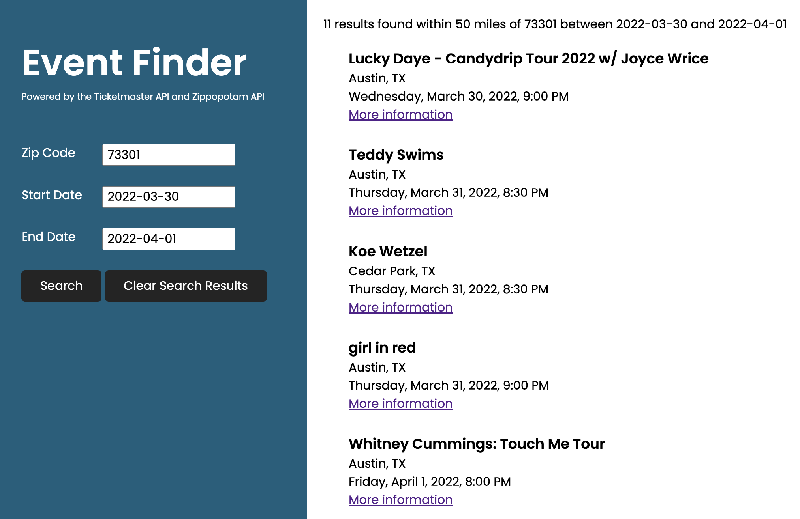

# Event Finder

**Project for GA JavaScript Course (Unit 2)**

This app uses the **[Ticketmaster API](https://developer.ticketmaster.com/)** to let the user search for events. Users may _optionally_ enter a **zip code** and/or **dates** to filter search results.

The **[Zippopotam API](http://www.zippopotam.us/)** is used to convert zip code into latitude and longitude for the Ticketmaster API to support searching within a 50 mile radius.

**JQuery** is used for the Start Date/End Date datepickers.

---

## Event Details

When users click **More information**, they are taken to an event details page that includes an image for the event and a link to purchase tickets.

The current search results are stored in localStorage so that users can revisit search results.

